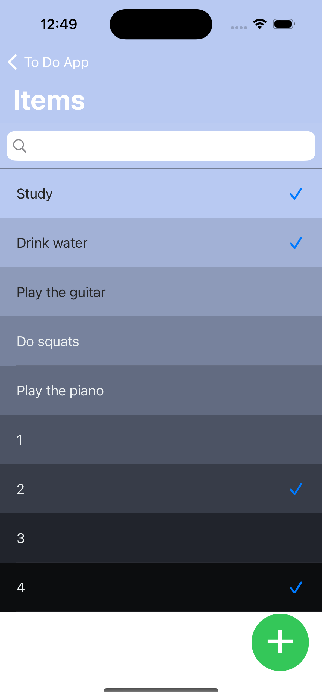

# To-Do-App
App that helps keeping track of things we need to do. The user can add or delete categories, and the can also add, delete and check tasks. They are sorted according to the time they were added. The cells are swipable. Chameleon Framework is doing all the logic concerning the color.
Technologies used: 
Realm, Cocoapods, SwipeCellKit, ChameleonFramework
-----------------------------------------------------
 
 
 

